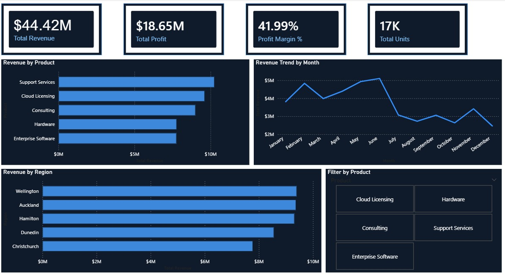

# Power BI Portfolio – NZ Financial Dashboard

## Overview
An interactive Power BI dashboard analysing fictional NZ sales data across products, regions, and customers. Built to demonstrate core BI Analyst skills including data modelling, DAX measures, and professional report design.

## Dashboard Preview

### Page 1 – Sales Overview

### Page 2 – Customer Analysis

## Dashboard Pages

### Page 1 – Sales Overview
- KPI Cards: Total Revenue ($44.42M), Total Profit ($18.65M), Profit Margin % (41.99%), Total Units (17K)
- Revenue by Product (bar chart)
- Revenue Trend by Month (line chart)
- Revenue by Region (bar chart)
- Filter by Product (slicer)

### Page 2 – Customer Analysis
- Revenue by Customer
- Profit by Customer
- Units by Customer
- Profit Margin % by Customer
- Filter by Region (slicer)

## Tech Stack
- Power BI Desktop
- DAX (Data Analysis Expressions)
- CSV data source (714 rows, 30 months)

## Data
- 5 Products: Support Services, Cloud Licensing, Consulting, Hardware, Enterprise Software
- 5 NZ Regions: Auckland, Wellington, Hamilton, Dunedin, Christchurch
- 10 NZ Customers including Fletcher Building, Spark NZ, ANZ Bank, Air New Zealand

## Author
Srikanth Madala | BI Analyst | Auckland, NZ
